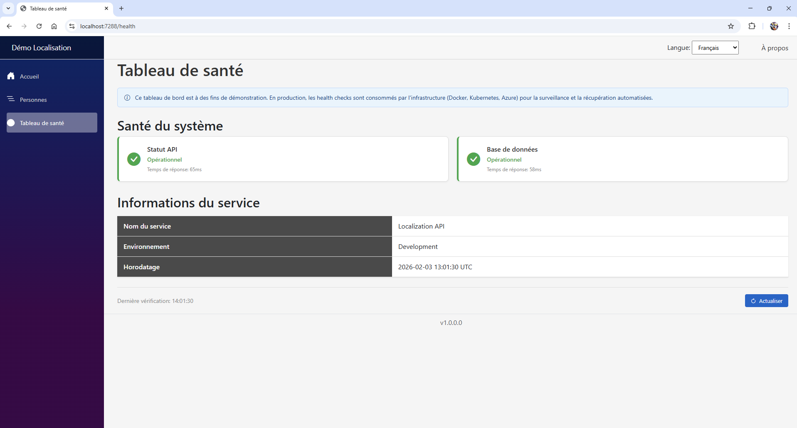
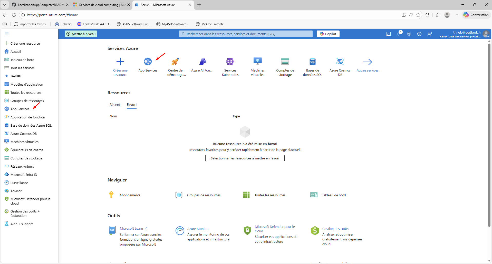
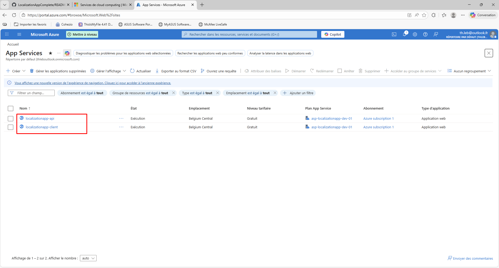
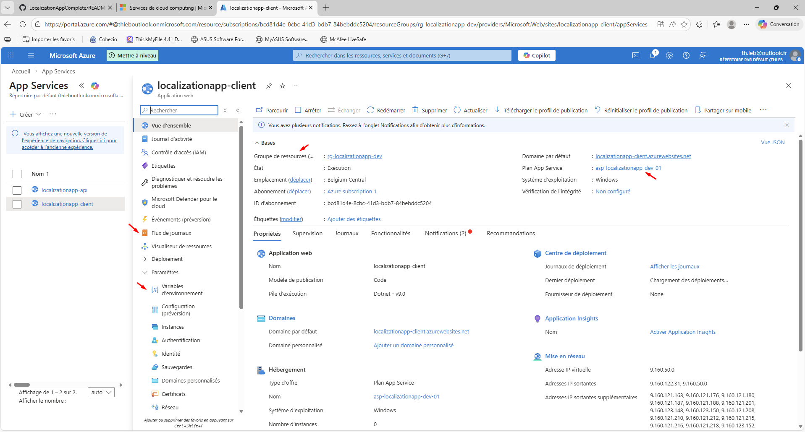
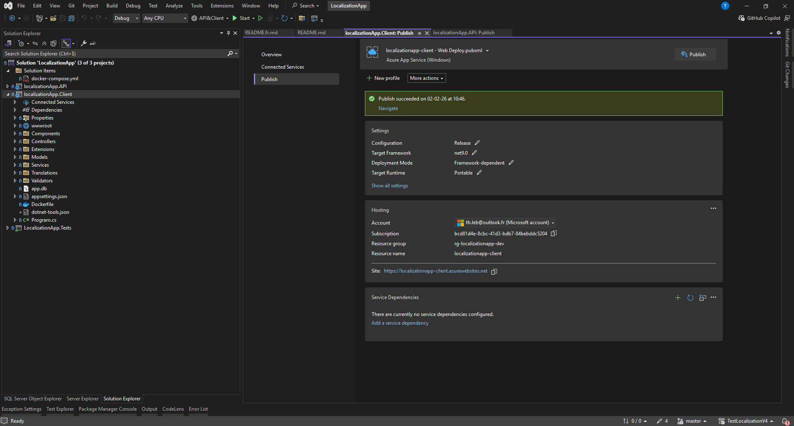

# Localization Demo

🇫🇷 [Version française](README.fr.md)

A Blazor Server application demonstrating JSON-based localization with a REST API backend.


## Live Demo

- **Blazor Client**: https://localizationapp-client.azurewebsites.net
- **API**: https://localizationapp-api.azurewebsites.net/api/persons

---

## Why This Project?

### The Localization Problem in .NET

The standard approach in .NET for localization uses `.resx` files. While it works, it has some limitations:

| Limitation | Impact |
|------------|--------|
| Compiled XML files | Requires recompilation to change a translation |
| Hard to version | Frequent Git conflicts on XML files |
| Not readable by non-devs | Translators can't easily edit them |
| Flat structure | All keys at the same level, no hierarchy |
| Tooling required | Need Visual Studio or special tools |

### My Solution: JSON Files

I chose JSON files for translations because:

| Advantage | Why it matters |
|-----------|----------------|
| No recompilation | Change a JSON file, refresh the page |
| Git-friendly | JSON = plain text, easy to merge |
| Readable by anyone | A translator can edit without Visual Studio |
| Hierarchical structure | Organized by domain (Global, Person, etc.) |
| Universal standard | JSON is used everywhere (React, Angular, etc.) |

### File Structure

```
Translations/
├── Global.en.json    ← Navigation, common buttons
├── Global.fr.json
├── Global.nl.json
├── Person.en.json    ← Labels, messages for Person module
├── Person.fr.json
├── Person.nl.json
├── Health.en.json    ← Health Dashboard labels
├── Health.fr.json
└── Health.nl.json
```

### Usage in Blazor

```csharp
@inject TranslationService Trad

<h1>@Trad.Person.Titles["PageTitle"]</h1>
<label>@Trad.Person.Labels["FirstName"]</label>
```

---

## Features

### Blazor Client
- Multi-language support (EN, FR, NL) with JSON files
- Full CRUD for person management
- Health Dashboard — visual monitoring of API and database status
- Validation with FluentValidation
- Responsive UI with Bootstrap
- Version number display

### REST API
- CQRS architecture with MediatR
- Vertical Slice Architecture
- FluentValidation with Pipeline Behavior
- Health checks (`/health`, `/ready`) + service info (`/api/info`)
- Mapping with Mapster
- Swagger documentation
- Global exception middleware

---

## Technologies

| Technology | Version |
|------------|---------|
| .NET | 9.0 |
| Blazor Server | 9.0 |
| Entity Framework Core | 9.0 |
| MediatR | 12.x |
| FluentValidation | 12.x |
| Mapster | 7.x |
| SQLite | - |
| Docker | - |

---

## Screenshots

### Language Selector


### Home Page (French)


### Person List


### Form with Validation


### Edit Form


### Delete Confirmation


### API Swagger


### Health Dashboard


---

## Health Dashboard

### Why a health page?

In a real production environment, health checks are invisible. Docker, Kubernetes, or Azure call them automatically behind the scenes to figure out if the application is alive and if its dependencies (database, external APIs, etc.) are reachable. If something goes wrong, the infrastructure can restart the container or stop routing traffic to it — all without human intervention.

The thing is, none of that is visible just by reading the code. So I added a "Health Dashboard" page in the Blazor client that calls the exact same endpoints the infrastructure would use. It's there for demonstration purposes, but it actually shows two things at once: the backend implementation (health check middleware, Options pattern, dedicated controller) and the frontend work (calling REST endpoints from Blazor, handling loading states, rendering results with visual indicators).

### What the dashboard shows

The page is accessible at `/health` on the client. It displays two status cards:

- **API Status** — calls `/health` on the API. This is the liveness check: it confirms the process is running.
- **Database** — calls `/ready` on the API. This is the readiness check: it actually tries to query SQLite to confirm the database is reachable.

Below that, a table pulls service information from `/api/info`: the service name, which environment is running, and a UTC timestamp.

Each card turns green or red depending on the result, and shows the response time in milliseconds. A refresh button lets you re-run everything on demand.

### Test it yourself

Once the application is running (Docker or Visual Studio), you can hit each endpoint directly:

| Endpoint | URL (Docker) | What it returns |
|----------|--------------|-----------------|
| Liveness | http://localhost:5001/health | `Healthy` if the API process is running |
| Readiness | http://localhost:5001/ready | `Healthy` if the database connection works |
| Service info | http://localhost:5001/api/info | JSON with service name, environment, timestamp |
| Dashboard | http://localhost:5000/health | Visual page that calls all three endpoints above |

From the command line:

```bash
# Is the API alive?
curl http://localhost:5001/health

# Can it reach the database?
curl http://localhost:5001/ready

# Service info (JSON response)
curl http://localhost:5001/api/info
```

### How it's built

**API side** — Health checks use the built-in `Microsoft.Extensions.Diagnostics.HealthChecks` package. Two checks are registered with different tags: a "self-live" check that always returns Healthy (the process is up), and a "database-ready" check that actually calls `CanConnect()` on the SQLite context. The `/health` endpoint filters on the `live` tag, `/ready` filters on the `ready` tag. The `/api/info` endpoint is a separate controller that reads from `AppOptions` (configured in `appsettings.json`, overridable via environment variables).

**Client side** — A `HealthService` calls these three endpoints and wraps each call in a `Stopwatch` to measure latency. The `HealthDashboard.razor` page consumes this service and renders the results. Like everything else in the app, all labels and messages go through the translation system (`Health.en.json`, `Health.fr.json`, `Health.nl.json`).

### Docker HEALTHCHECK

The API Dockerfile includes a `HEALTHCHECK` instruction:

```dockerfile
HEALTHCHECK --interval=30s --timeout=3s --start-period=10s --retries=3 \
    CMD curl -fsS http://localhost:8080/health || exit 1
```

Docker runs this every 30 seconds. If it fails 3 times in a row, the container gets marked as "unhealthy". In `docker-compose.yml`, the client service uses `depends_on` with `condition: service_healthy`, which means it won't start until the API has actually passed its first health check. No more race conditions where the client boots up and tries to call an API that isn't ready yet.

---

## Getting Started with Docker

### What is Docker?

Docker allows you to run applications in isolated containers. Instead of installing .NET, SQLite, and configuring everything manually, you just run one command and everything works.

### Prerequisites

1. **Install Docker Desktop**
   - Download from: https://docs.docker.com/get-started/get-docker/
   - Available for Windows, Mac, and Linux
   - After installation, make sure Docker Desktop is running

2. **Check that ports 5000 and 5001 are available**
   - Port 5000: Blazor Client
   - Port 5001: API

### Running the Application

```bash
# Clone the repository
git clone https://github.com/thierry-cmd/LocalizationAppComplete.git
cd LocalizationAppComplete

# Build and start the containers
docker-compose up --build
```

Wait for the build to complete. You'll see the API start, pass its health check, and then the client will start automatically. When ready, open:
- Client: http://localhost:5000
- API: http://localhost:5001/api/persons
- Health Dashboard: http://localhost:5000/health

### Docker Commands

| Command | Description |
|---------|-------------|
| `docker-compose up --build` | Build images and start containers |
| `docker-compose up` | Start containers (without rebuilding) |
| `docker-compose down` | Stop and remove containers |
| `docker-compose down -v` | Stop containers AND delete data |
| `docker-compose logs -f` | View logs in real-time |

### Data Persistence

The `docker-compose.yml` file includes a volume for the API database:

```yaml
volumes:
  - api-data:/app/data
```

This means:
- `docker-compose down` → Data is **kept**
- `docker-compose down -v` → Data is **deleted**

### How It Works

```
┌─────────────────────────────────────────────────────────┐
│                   Docker Network                         │
│  ┌─────────────────┐         ┌─────────────────┐        │
│  │     Client      │         │      API        │        │
│  │   (Port 5000)   │ ──────> │   (Port 5001)   │        │
│  │                 │  HTTP   │                 │        │
│  │  Blazor Server  │         │  .NET API       │        │
│  └─────────────────┘         └────────┬────────┘        │
│                                       │                 │
│                              ┌────────▼────────┐        │
│                              │    SQLite DB    │        │
│                              │   (Volume)      │        │
│                              └─────────────────┘        │
│                                                         │
│  Client waits for API health check before starting      │
│  (depends_on → condition: service_healthy)               │
└─────────────────────────────────────────────────────────┘
```

---

## Running with Visual Studio

1. Open `LocalizationApp.sln`
2. Right-click on Solution → Properties
3. Select "Multiple startup projects"
4. Set both API and Client to "Start"
5. Press F5

---

## Project Structure

```
LocalizationApp/
├── src/
│   ├── localizationApp.API/
│   │   ├── Behaviors/          # MediatR pipeline
│   │   ├── Controllers/        # API Controllers (+ InfoController)
│   │   ├── Data/               # DbContext
│   │   ├── Features/           # CQRS (Commands/Queries)
│   │   │   └── Persons/
│   │   │       ├── Commands/
│   │   │       └── Queries/
│   │   ├── Mapping/            # Mapster configuration
│   │   ├── Middleware/         # Exception handler
│   │   └── Models/             # Entities, DTOs, AppOptions
│   │
│   ├── localizationApp.Client/
│   │   ├── Components/         # Blazor pages and components
│   │   │   └── Pages/
│   │   │       └── HealthDashboard.razor
│   │   ├── Services/           # Services (HttpClient, Translation, Health)
│   │   ├── Translations/       # JSON translation files (incl. Health.xx.json)
│   │   └── Validators/         # FluentValidation
│   │
│   └── localizationApp.Tests/  # Unit tests
│
├── docker-compose.yml
└── README.md
```

---

## API Endpoints

| Method | Endpoint | Description |
|--------|----------|-------------|
| GET | /api/persons | List all persons |
| GET | /api/persons/{id} | Get a person by ID |
| GET | /api/persons/list | Light list (simplified DTO) |
| POST | /api/persons | Create a person |
| PUT | /api/persons/{id} | Update a person |
| DELETE | /api/persons/{id} | Delete a person |
| GET | /health | Liveness check (is the API process running?) |
| GET | /ready | Readiness check (is the database reachable?) |
| GET | /api/info | Service name, environment, timestamp |

---

## Azure Deployment

### What is Azure?

Azure is Microsoft's cloud platform. It offers many services, but for this project we use **Azure App Service** - a managed hosting service for web applications. You deploy your code, Azure handles the rest (servers, updates, scaling).

More info: https://azure.microsoft.com

### Why App Service?

| Service | Use case |
|---------|----------|
| Virtual Machines | Full control, you manage everything |
| **App Service** | Simplest option, no infrastructure to manage |
| Kubernetes (AKS) | Advanced container orchestration |
| Container Apps | Simplified containers without Kubernetes |
| Functions | On-demand code (events, webhooks) |

For a demo project like this, App Service with the Free tier is perfect.

### Architecture

```
┌──────────────────┐         ┌──────────────────┐
│   Azure App      │         │   Azure App      │
│   Service        │ ──────> │   Service        │
│                  │  HTTPS  │                  │
│   Client         │         │   API            │
│   (Free tier)    │         │   (Free tier)    │
└──────────────────┘         └──────────────────┘
```

### Azure Portal



The Azure Portal is where you manage all your resources. Go to **App Services** to see your web applications.

### Our App Services



We have two App Services:
- `localizationapp-api` - The REST API
- `localizationapp-client` - The Blazor frontend

Both are hosted in **Belgium Central** region, using the **Free** tier, and share the same App Service Plan.

### Resource Naming Convention

Following [Azure best practices](https://learn.microsoft.com/en-us/azure/cloud-adoption-framework/ready/azure-best-practices/resource-naming):

| Resource | Name | Pattern |
|----------|------|---------|
| Resource Group | `rg-localizationapp-dev` | `rg-{app}-{env}` |
| App Service Plan | `asp-localizationapp-dev-01` | `asp-{app}-{env}-{number}` |
| Web App (API) | `localizationapp-api` | `{app}-{role}` |
| Web App (Client) | `localizationapp-client` | `{app}-{role}` |

### App Service Configuration



Key settings to note:
- **Log stream** - View real-time logs
- **Environment variables** - Configure app settings
- **Default domain** - Your app's public URL

### Deployment from Visual Studio



1. Right-click on project → **Publish**
2. Select **Azure** → **Azure App Service (Windows)**
3. Select your subscription and App Service
4. Click **Publish**

The publish profile is saved in your project for future deployments.

### Step-by-Step Deployment

Everything is done directly from Visual Studio (except creating your Azure account).

#### 1. Create an Azure Account

Go to https://azure.microsoft.com and create a free account if you don't have one.

#### 2. Publish the API from Visual Studio

1. Right-click on `localizationApp.API` → **Publish**
2. Select **Azure** → **Next**
3. Select **Azure App Service (Windows)** → **Next**
4. Click **Create a new Azure App Service**
5. Fill in the form:
   - **Name**: `localizationapp-api`
   - **Resource Group**: Click **New** → `rg-localizationapp-dev`
   - **Hosting Plan**: Click **New** → `asp-localizationapp-dev-01`, select **Free F1**
6. Click **Create**
7. Click **Finish** then **Publish**

#### 3. Publish the Client from Visual Studio

1. Right-click on `localizationApp.Client` → **Publish**
2. Same process as the API
3. **Important**: Select the **same Resource Group** and **same Hosting Plan** (saves money!)
4. **Name**: `localizationapp-client`
5. Click **Create** then **Publish**

#### 4. Configure Environment Variables

After publishing, go to the Azure Portal to set environment variables.

**For the Client:**

Go to App Service → **Settings** → **Environment variables**

| Name | Value |
|------|-------|
| `ApiBaseUrl` | `https://localizationapp-api.azurewebsites.net` |
| `ASPNETCORE_ENVIRONMENT` | `Production` |

**For the API:**

| Name | Value |
|------|-------|
| `ASPNETCORE_ENVIRONMENT` | `Production` |

#### 5. Configure CORS

The API must accept requests from the Client. In `Program.cs`:

```csharp
policy.WithOrigins(
    "https://localhost:7288",           // Local dev
    "http://localhost:5000",            // Docker
    "https://localizationapp-client.azurewebsites.net"  // Azure
)
```

**Important**: Every time you change the Client URL, you must update CORS on the API and republish.

### Common Issues and Solutions

| Problem | Cause | Solution |
|---------|-------|----------|
| 404 Not Found | Wrong `ApiBaseUrl` | Check environment variable in Azure |
| CORS blocked | Azure URL not allowed | Add URL to CORS policy, republish API |
| SQLite error in Docker | `/app/data` folder missing | Add `RUN mkdir -p /app/data` in Dockerfile |
| Data lost on restart | No volume configured | Add volume in docker-compose.yml |

### .NET Configuration Hierarchy

```
1. appsettings.json                 ← Base configuration
2. appsettings.{Environment}.json   ← Environment-specific
3. Environment variables            ← Overrides everything (Azure uses this)
4. Command line arguments           ← Highest priority
```

### Pricing

| Plan | Price | Use case |
|------|-------|----------|
| Free F1 | Free | Testing, learning |
| Basic B1 | ~€13/month | Dev, small apps |
| Standard S1 | ~€70/month | Production |

---

## Tests

The project includes 67 unit tests.

### Running Tests

```bash
cd src/localizationApp.Tests
dotnet test
```

### Test Coverage

| Category | Tests | Description |
|----------|-------|-------------|
| API Commands | 33 | Create, Update, Delete (handlers + validators) |
| API Queries | 27 | GetAll, GetById, GetPersonsList |
| Localization | 6 | JSON loading, English fallback |
| Client Validation | 1 | DTO validation |

### Test Structure

```
localizationApp.Tests/
├── Features/
│   └── Persons/
│       ├── Commands/
│       │   ├── CreatePersonCommandTests.cs
│       │   ├── UpdatePersonCommandTests.cs
│       │   └── DeletePersonCommandTests.cs
│       └── Queries/
│           ├── GetAllPersonsQueryTests.cs
│           ├── GetPersonByIdQueryTests.cs
│           └── GetPersonsListQueryTests.cs
├── Services/
│   └── Translation/
│       └── JsonTranslationLoaderTests.cs
└── Validators/
    └── CreatePersonDtoValidatorTests.cs
```

---

## What This Project Demonstrates

- Custom solution when standard tools don't fit the need
- Understanding of technical trade-offs
- Modular architecture (separation by domain)
- Health checks and infrastructure monitoring
- Docker containerization with service orchestration
- Cloud deployment (Azure)
- Unit testing with xUnit
- Focus on maintainability

---

## License

MIT

## Author

Thierry Leblanc
