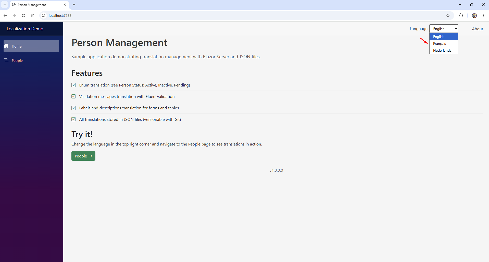
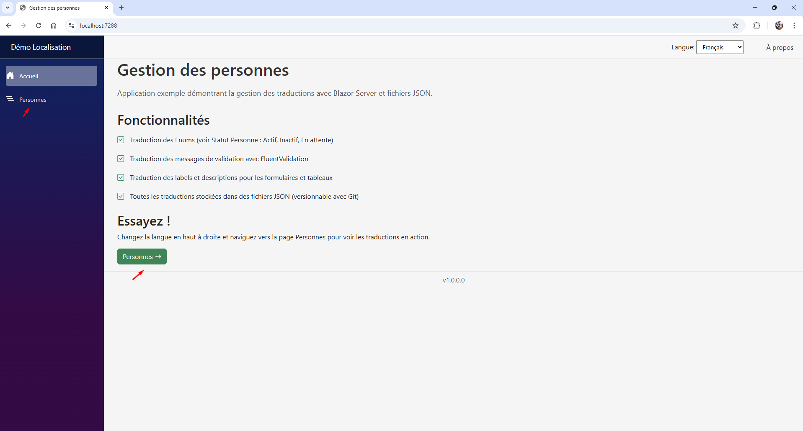
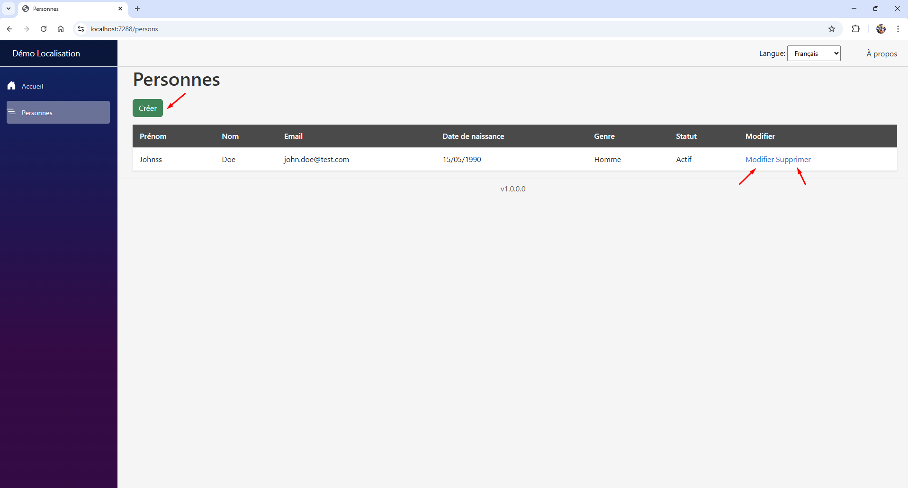
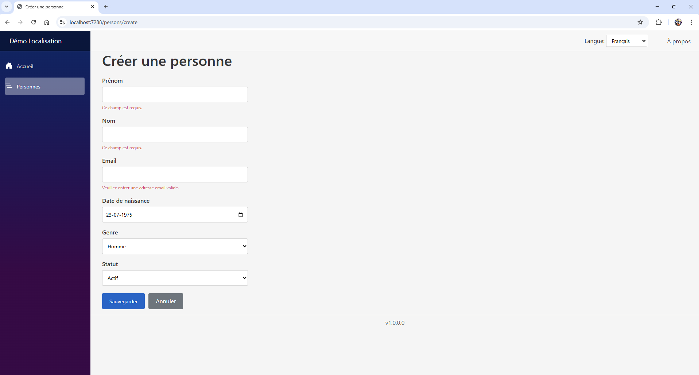
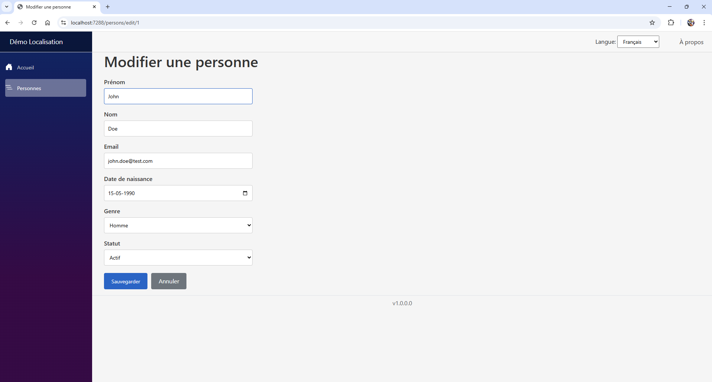
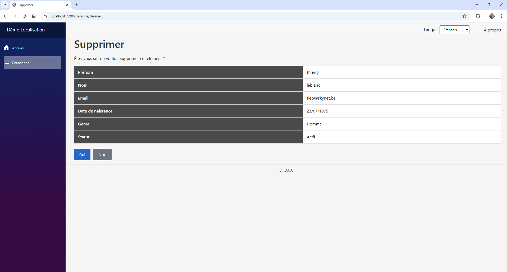
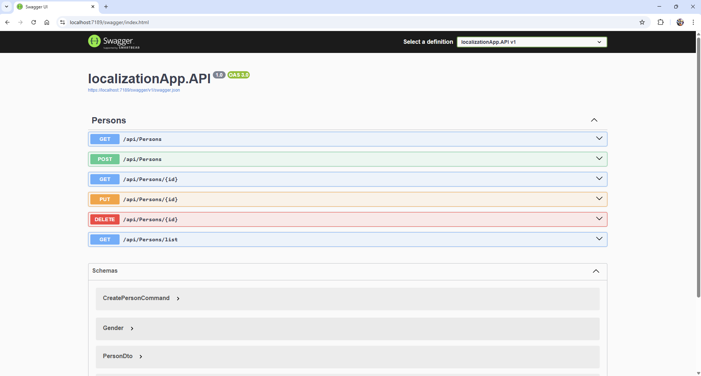

# Localization Demo

Application de démonstration Blazor Server avec localisation JSON et API REST.



## 🌐 Démo en ligne

- **Client Blazor** : https://localizationapp-client.azurewebsites.net
- **API** : https://localizationapp-api.azurewebsites.net/api/persons

## ✨ Fonctionnalités

### Client Blazor
- 🌍 Localisation multilingue (EN, FR, NL) avec fichiers JSON
- 📝 CRUD complet pour la gestion des personnes
- ✅ Validation avec FluentValidation
- 🎨 Interface responsive avec Bootstrap
- 🔢 Affichage du numéro de version

### API REST
- 🏗️ Architecture CQRS avec MediatR
- 📁 Vertical Slice Architecture
- ✅ FluentValidation avec Pipeline Behavior
- 🗺️ Mapping avec Mapster
- 📖 Documentation Swagger
- 🔒 Middleware de gestion des exceptions

## 🛠️ Technologies

| Technologie | Version |
|-------------|---------|
| .NET | 9.0 |
| Blazor Server | 9.0 |
| Entity Framework Core | 9.0 |
| MediatR | Latest |
| FluentValidation | 12.x |
| Mapster | Latest |
| SQLite | - |
| Docker | - |

## 📸 Screenshots

### Sélecteur de langue


### Page d'accueil (Français)


### Liste des personnes


### Formulaire avec validation


### Modification


### Suppression


### API Swagger


## 🚀 Démarrage rapide

### Prérequis
- .NET 9.0 SDK
- Docker (optionnel)

### Option 1 : Docker Compose (recommandé)
```bash
git clone https://github.com/thierry-cmd/LocalizationAppComplete.git
cd LocalizationAppComplete
docker-compose up --build
```

Accéder à :
- Client : http://localhost:5000
- API : http://localhost:5001/api/persons

### Option 2 : Visual Studio

1. Ouvrir `LocalizationApp.sln`
2. Configurer les projets de démarrage multiples (API + Client)
3. Appuyer sur F5

## 📁 Structure du projet
```
LocalizationApp/
├── src/
│   ├── localizationApp.API/
│   │   ├── Behaviors/          # Pipeline MediatR
│   │   ├── Controllers/        # API Controllers
│   │   ├── Data/               # DbContext
│   │   ├── Features/           # CQRS (Commands/Queries)
│   │   │   └── Persons/
│   │   │       ├── Commands/
│   │   │       └── Queries/
│   │   ├── Mapping/            # Configuration Mapster
│   │   ├── Middleware/         # Exception Handler
│   │   └── Models/             # Entités et DTOs
│   │
│   ├── localizationApp.Client/
│   │   ├── Components/         # Pages et composants Blazor
│   │   ├── Services/           # Services (HttpClient)
│   │   ├── Translations/       # Fichiers JSON de traduction
│   │   └── Validators/         # FluentValidation
│   │
│   └── localizationApp.Tests/  # Tests unitaires
│
├── docker-compose.yml
└── README.md
```

## 🔌 API Endpoints

| Méthode | Endpoint | Description |
|---------|----------|-------------|
| GET | /api/persons | Liste toutes les personnes |
| GET | /api/persons/{id} | Récupère une personne |
| GET | /api/persons/list | Liste légère (DTO simplifié) |
| POST | /api/persons | Crée une personne |
| PUT | /api/persons/{id} | Modifie une personne |
| DELETE | /api/persons/{id} | Supprime une personne |

## 🌍 Localisation

Les traductions sont stockées dans des fichiers JSON :
```
Translations/
├── Global/
│   ├── en.json
│   ├── fr.json
│   └── nl.json
└── Person/
    ├── en.json
    ├── fr.json
    └── nl.json
```

Exemple d'utilisation dans Blazor :
```csharp
@inject TranslationService Trad

<h1>@Trad.Person.Titles["PageTitle"]</h1>
```

## ☁️ Déploiement Azure

L'application est déployée sur Azure App Service :

| Service | URL |
|---------|-----|
| Client Blazor | https://localizationapp-client.azurewebsites.net |
| API | https://localizationapp-api.azurewebsites.net |

### Variables d'environnement Azure

**Client :**
- `ApiBaseUrl` : URL de l'API
- `ASPNETCORE_ENVIRONMENT` : Production

**API :**
- `ASPNETCORE_ENVIRONMENT` : Production

## 🧪 Tests
```bash
cd src/localizationApp.Tests
dotnet test
```

## 📝 Licence

MIT

## 👤 Auteur

Thierry Leblanc